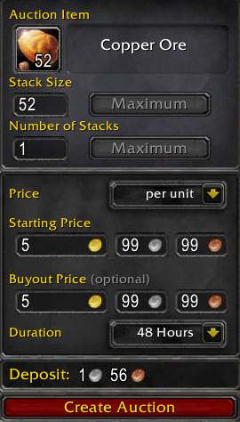

# Good Auction Defaults: A World of Warcraft addon

*Small UI tweaks to the sell pane of Blizzard's auction house UI.*

## Features

* Defaults duration to "48 Hours"
* Defaults price type to "per unit"
* Prepopulates the starting and buyout price fields with the buyout price of your most
  recent auction for the selected item

## Screenshot

## Installation

Option 1:
1. `git clone` into the `/World of Warcraft/Interface/AddOns` directory

Option 2:
1. Create a directory in `/World of Warcraft/Interface/AddOns`
2. Copy all `lua` and `toc` files into this directory
